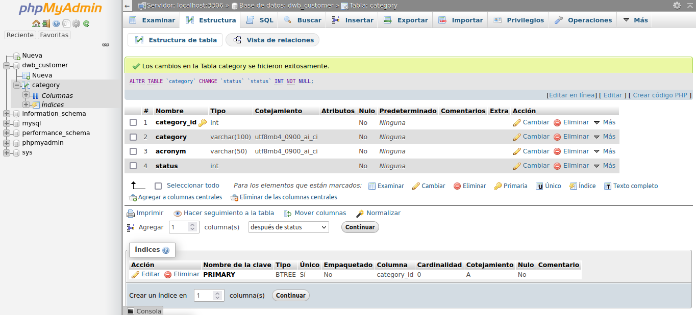

# Práctica 5

## Zamora Cruz Diego Arturo - 316249560

La práctica fue programada y probada con

- Spring Boot: 2.7.8
- Java: 11
- Eclipse IDE: 2022-09
- Postman: 10.10.9
- MySQL 8.0.32
  * base de datos: `dwb_customer`
  * usuario: `root`
  * password: `123456`

Instrucciones de ejecución

1. Dentro de la base de datos, creamos una tabla llamada `category` con columnas
   * *category_id* : tipo int, no puede ser nulo ni tiene valor predeterminado.
   * *category* : tipo varchar(100), no puede ser nulo ni tiene valor predeterminado.
   * *acronym* : tipo varchar(50), no puede ser nulo ni tiene valor predeterminado.
   * *status* : tipo int, no puede ser nulo ni tiene valor predeterminado.

| 
|:----------------------:|
| Configuracion en phpMyAdmin.

2. Ejecutamos el programa son el software de su preferencia
3. Para probar cada metodo programado, se uso Postman, para facilitar las pruebas se agregado el archivo [PruebasP5](PruebasP5.json). Antes de realizar cualquier prueba se recimienda agregar al menos un par de elementos a la base de datos
```bash
{
 "category": "Celulares",
 "acronym": "Cel"
}
```
   
```bash
{
 "category": "Musica",
 "acronym": "Mus"
}
```