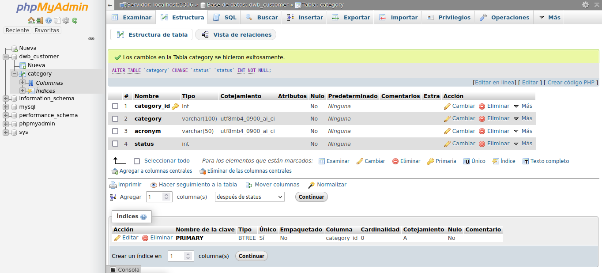
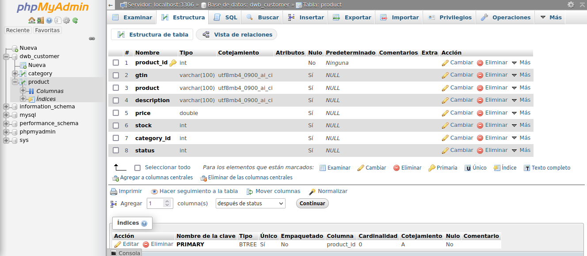

# Práctica 6

## Zamora Cruz Diego Arturo - 316249560

La práctica fue programada y probada con

- Spring Boot: 2.7.8
- Java: 11
- Eclipse IDE: 2022-09
- Postman: 10.10.9
- MySQL 8.0.32
  * base de datos: `dwb_customer`
  * usuario: `root`
  * password: `123456`

Instrucciones de ejecución

### Creacion de la tabla Category

Dentro de la base de datos, creamos una tabla llamada `category` con columnas
   * *category_id* : llave de tipo int.
   * *category* : de tipo varchar(100).
   * *acronym* : de tipo varchar(50).
   * *status* : de tipo int.

| 
|:----------------------:|
| Configuracion de tabla `category` en phpMyAdmin.


### Creacion de la tabla Product

Dentro de la base de datos, creamos una tabla llamada `product` con columnas
   * *product_id* : llave de tipo int.
   * *gtin* : de tipo varchar(100).
   * *product* : de tipo varchar(100).
   * *description* : de tipo varchar(100).
   * *price* : de tipo double.
   * *stock* : de tipo int.
   * *category_id* : de tipo int.
   * *status* : de tipo int.

| 
|:----------------------:|
| Configuracion de tabla `product` en phpMyAdmin.


### Ejecucion del software

1. Ejecutamos el programa son el software de su preferencia (spring tool suite, NetBeans, etc.)
2. Para probar cada metodo programado, se uso Postman, para facilitar las pruebas se agregado el archivo [PruebasP6](PruebasP6.json). Antes de realizar cualquier prueba se recomienda agregar al menos un par de elementos a la base de datos

**Objetos de la clase Category**

```bash
{
    "category": "Celulares",
    "acronym": "Cel"
}
```
   
```bash
{
    "category": "Musica",
    "acronym": "Mus"
}
```

**Objetos de la clase Product**
```bash
{
    "gtin": "Gtin1",
    "product": "Nokia",
    "description": "Kokia con 3 camaras",
    "price": "200",
    "stock": "20",
    "category_id": "1"
}
```